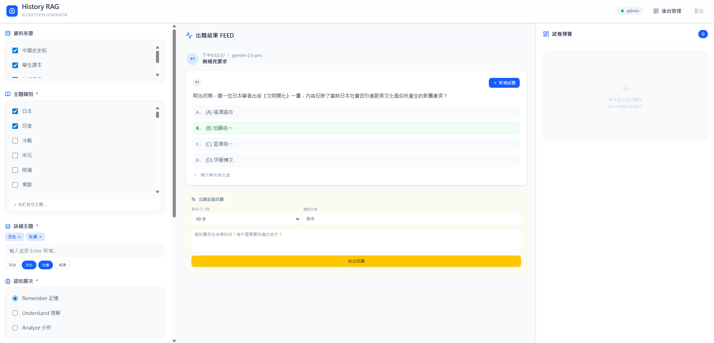
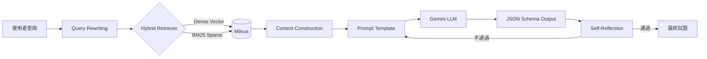
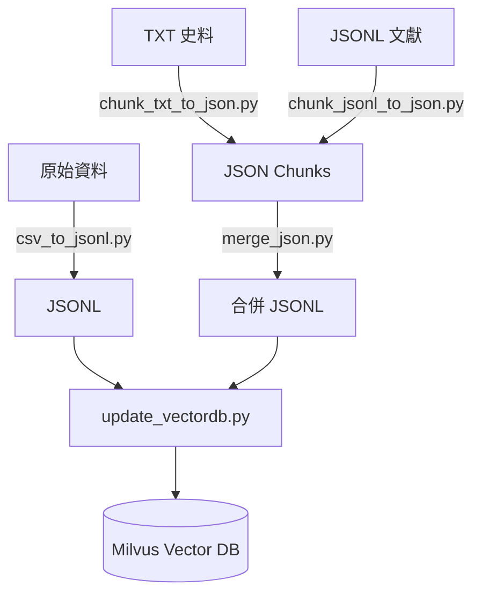

# DH-RAG 📚 數位人文歷史出題系統

<p align="center">
  
</p>

> 結合 **Retrieval-Augmented Generation (RAG)** 與歷史文獻知識庫，自動生成高品質歷史科多選題。

[](https://www.python.org/)
[](https://python.langchain.com/)
[](https://ai.google.dev/)
[](https://milvus.io/)

---

## ✨ 功能特色

- **智慧出題**：依據指定主題，從知識庫檢索相關文獻並生成含題幹、選項、答案與解析的多選題
- **多模式檢索**：語意檢索 (Dense)、關鍵字檢索 (BM25)、混合檢索 (Hybrid) 三種模式可切換
- **自我修正機制**：兩階段 Self-Reflection（Evaluator → Optimizer）提升出題品質
- **完整資料管線**：資料前處理 → 切分 (Chunking) → 向量化 → 資料庫建立
- **Web 應用介面**：React + FastAPI 前後端分離，支援試題生成、預覽、匯出 (Excel/JSON)
- **高度可配置**：透過 `config.yaml` 集中管理模型、Prompt 與資料庫設定

---

## 🏗️ 系統架構



---

## 📂 專案結構

```
DH_RAG/
├── config.yaml                         # 全域設定（模型、Prompt、Milvus）
├── requirements.txt                    # Python 依賴
├── .env.example                        # 環境變數範本
│
├── src/                                # 核心 RAG 程式碼
│   ├── rag.py                          # RAG Chain 主邏輯 (LangChain LCEL)
│   ├── utils.py                        # RecursiveTextSplitterLite 文本切分
│   └── remote_embeddings.py            # 遠端 Embedding API 客戶端
│
├── scripts/                            # 資料處理與 DB 管理
│   ├── update_vectordb.py              # 建立 / 更新向量資料庫
│   ├── read_vectordb.py                # 檢視資料庫內容
│   ├── delete_vectordb.py              # 刪除重複資料
│   ├── analyze_token_distribution.py   # Token 分布分析
│   └── preprocessing/                  # 資料前處理腳本
│       ├── csv_to_jsonl.py             # CSV → JSONL 轉換
│       ├── chunk_jsonl_to_json.py       # JSONL 文獻切分
│       ├── chunk_txt_to_json.py         # TXT 文獻切分（含簡繁轉換）
│       ├── merge_json.py               # 合併 JSON 為 JSONL
│       └── merge_jsonl.py              # 合併多個 JSONL
│
├── data/                               # 資料目錄
│   ├── raw/                            # 原始資料
│   │   ├── csv/                        # 教科書 / 學測 CSV
│   │   └── txt/                        # 中國史史料 TXT
│   ├── processed/                      # 處理後 JSONL（含 metadata）
│   ├── chunked_china/                  # 中國史切分結果 (JSON)
│   └── chunked_taiwan/                 # 臺灣史切分結果 (JSON)
│
├── embedding_service/                  # Embedding API 微服務
│   ├── Dockerfile                      # 多階段建置（含模型預載）
│   ├── embedding_api.py                # FastAPI 嵌入向量 API
│   ├── download_model.py               # 模型預下載腳本
│   └── requirements.txt                # 微服務依賴
│
├── web/                                # Web 應用程式
│   ├── backend/                        # FastAPI 後端 (RAG_core, server.py)
│   └── rag-frontend/                   # React + TypeScript + Vite 前端
│
└── docs/                               # 文件與圖表資源
    └── web_demo.png
```

---

## 🚀 快速開始

### 1. 安裝依賴

```bash
pip install -r requirements.txt
```

### 2. 設定環境變數

```bash
cp .env.example .env
# 編輯 .env，填入 GOOGLE_API_KEY
```

### 3. 建立向量資料庫

```bash
python scripts/update_vectordb.py
```

### 4. 執行 RAG 出題

```bash
python src/rag.py
```

---

## 🌐 啟動 Web 應用

```bash
# 啟動後端 (Port 8080)
cd web/backend
python server.py

# 啟動前端 (另一個終端)
cd web/rag-frontend
npm install && npm run dev
```

- 前端：`http://localhost:5173`
- Swagger API 文件：`http://localhost:8080/docs`

---

## ⚙️ 配置說明

所有核心設定集中於 [`config.yaml`](config.yaml)：

| 區塊 | 設定項 | 說明 |
|------|--------|------|
| `google` | `model` | Gemini 模型版本（`gemini-2.5-flash` / `gemini-2.5-pro`） |
| `google` | `temperature` | 生成溫度，0 為最確定性 |
| `google` | `json_schema` | 輸出 JSON 結構定義（題幹、選項、答案、解析） |
| `milvus` | `mode` | 檢索模式：`semantic` / `bm25` / `hybrid` |
| `milvus` | `collection_name` | Milvus Collection 名稱 |
| `retriever` | `k` | 檢索回傳文檔數量 |
| `prompt` | `question_generation` | 出題 Prompt 模板 |

---

## 📊 資料管線



### 資料來源

| 資料集 | 內容 | 格式 |
|--------|------|------|
| `Metadata_textbook` | 高中歷史教科書 | CSV → JSONL |
| `Metadata_textbook_teacher` | 教師用書 | CSV → JSONL |
| `學測歷史` | 歷屆學測試題 | CSV → JSONL |
| `Taiwan_jsons` | 臺灣文獻叢刊（29 部） | TXT → JSON |
| `China_json` | 中國史史料（10 部） | TXT → JSON |

---

## 🔧 Embedding 微服務

部署 BGE-M3 模型作為 Embedding API：

```bash
cd embedding_service
docker build -f Dockerfile -t embedding-api .
docker run -p 6666:6666 --gpus all embedding-api
```

API 端點：
- `POST /embed`：批量文字嵌入
- `GET /`：健康檢查

---

## 📝 授權

本專案供學術研究與數位人文應用課程參考使用。